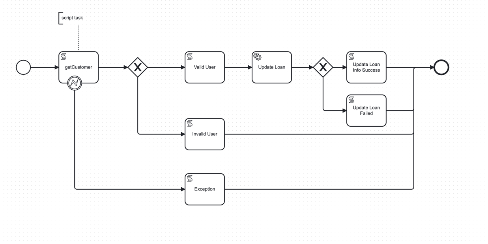

# Camunda Call External API to validate the User




>Groovy Script to fetch the user from external API and throw exception incase of error

```groovy
import wslite.rest.RESTClient
import wslite.rest.RESTClientException

def firstName = execution.getVariable("firstName")
def lastName = execution.getVariable("lastName")
def mobile = execution.getVariable("mobile")
def id = execution.getVariable("id")

def isValidUser = false


RESTClient client = new RESTClient("http://localhost:8080")
def path = "/customer/"+id
def response


try {
    println(path)
    response = client.get(path: path)
    println(response.contentAsString)


    if(response.contentAsString.contains(firstName)){
        isValidUser = true;
       
    }

     if(isValidUser && response.contentAsString.contains(lastName)){
        isValidUser = true;
       
    }

     if(isValidUser && response.contentAsString.contains(mobile)){
        isValidUser = true;
       
    }
   

    println(isValidUser)
    
    //return variables
    execution.setVariable("isValidUser", isValidUser)
   

} catch (RESTClientException e) {
    println("Exception Occured :: " + e)
    throw new org.camunda.bpm.engine.delegate.BpmnError("404Error");
}
```

CURL Command to call the BPMN flow
 
- Note: replace the process_definition_id in the request

```shell
curl --location 'http://localhost:9090/engine-rest/process-definition/customerAPiCall:3:d3a74bd8-32c0-11ee-ac4a-8ac983091590/start' \
--header 'Content-Type: application/json' \
--data '{
    "variables": {
        "firstName": {
            "value": "Alvira",
            "type": "String"
        },
        "lastName": {
            "value": "Culley",
            "type": "String"
        },
        "mobile": {
            "value": "+86 (484) 323-3861",
            "type": "String"
        },
        "loanType": {
            "value": "HL",
            "type": "String"
        },
        "loanAmount": {
            "value": 20000,
            "type": "Long"
        },
        "id": {
            "value": 111,
            "type": "Long"
        }
    },
    "businessKey": "Doom1",
    "withVariablesInReturn": true
}'
```